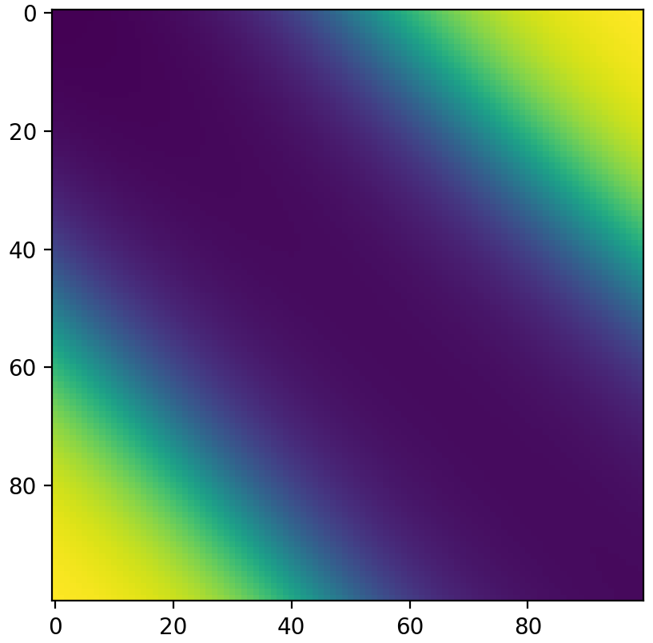

# deeplib
Python deep learning framework to easily implement different types of neural networks.

### Examples
Building a simple network,
```py
model = Network([
	Dense(in_size=512, out_size=32, init='uniform'),
	Activation('tanh'),
	Dense(in_size=32, out_size=1, init='logistic', seed=123),
	Activation('sigmoid')])
```

Training the model,
```py
model.prepare(optimizer=SGD(), loss=BinaryCrossEntropy(), batch_size=10)
model.fit(X, y)
```

### Current capabilities
 - Layers: dense, dropout, activation, normalization
 - Loss functions: MAE, MSE, BCE
 - Activations: linear, sigmoid, tanh, leaky, relu
 - Initializers: regular, uniform, logistic
 - Optimizers: SGD

#### TODO
 - [ ] more loss functions
 - [ ] more & better optimizers
 - [ ] convolutional layers
 - [ ] and only then multi-threading & GPU support?

#### XOR example
<p align="center">
  
<p/>
